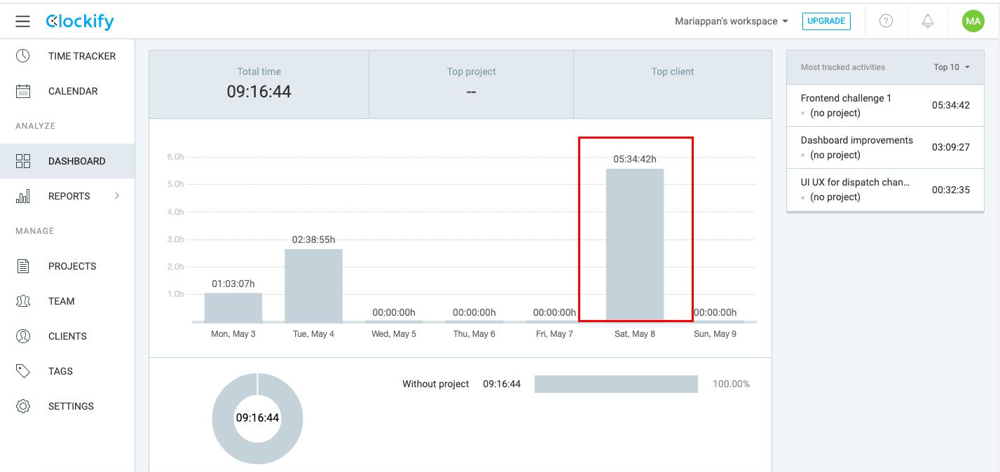

# coffee-challenges
Simple frontend challenges that you can complete in 30min - 1hr
Check the issues for challenges

# Submissions

1. Mariappan S 

- Linkedin Profile - https://www.linkedin.com/in/marigameo
- Github handle - https://github.com/Marigameo/
- Portfolio - https://mariappan.netlify.app/
- Email - mariappangameo@gmail.com

##### Time stats: 
 

Feel free to raise issues, run the code locally & understand (or) ask questions.
# Submit new challenge
Create a new issue (please check the old issues and try to be clear as much as possible including screenshots/videos/links as required)

If you're not a member already mail your challenge to mariappangameo@gmail.com. I'll make sure to list here. 

# How I can help you? 

I'll feature your profiles and can personally refer you to my circles (proved talented, which you'd eventually)
